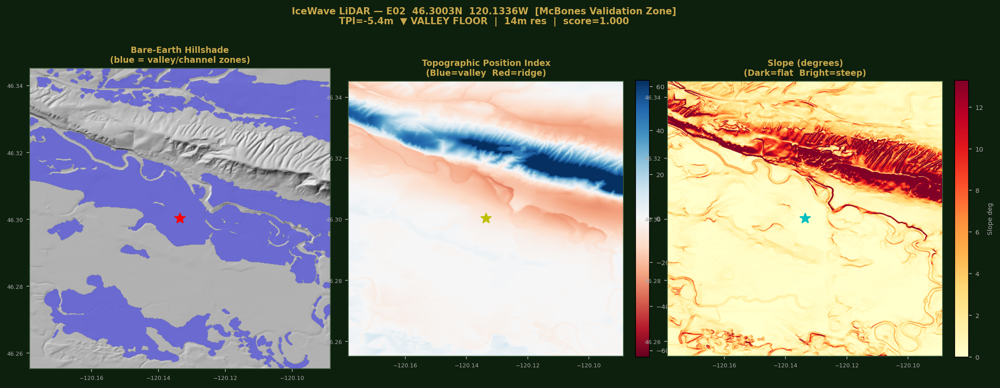
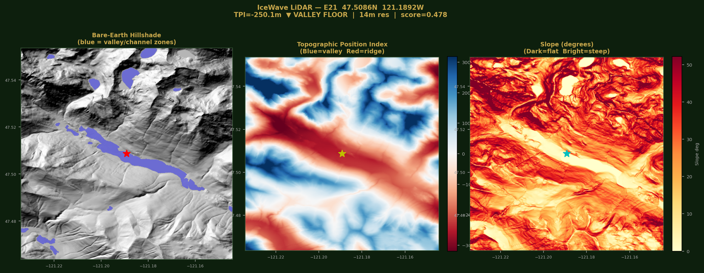
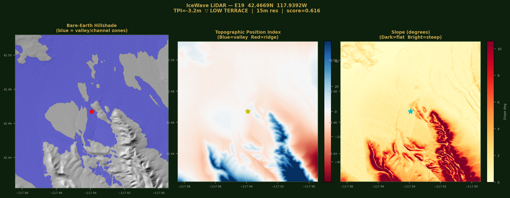

<div align="center">


# 🦣 Project IceWave

### Pleistocene Megafauna Locality Intelligence
#### Washington · Oregon · Nevada · Idaho · Montana

[](https://github.com/bdgroves/project_ice_wave)
[](https://github.com/bdgroves/project_ice_wave)
[](https://mcbones.org)
[](https://github.com/bdgroves/project_ice_wave)

*Split-ecoregion Random Forest ML model predicting Pleistocene megafauna fossil localities from USGS terrain, SGMC lithology, and PBDB/iDigBio occurrence data.*

</div>

---

## ✅ Blind Validation — The Model Called Its Shot

> Target **E02** (46.3003°N, 120.1336°W) was predicted as the **#1 east target** before any knowledge of existing dig sites. March 2026: active Columbian mammoth excavation confirmed at **McBones Coyote Canyon** near Kennewick, WA. LiDAR TPI independently confirms valley floor geometry at the predicted pixel. Three methods. One answer.

| | Latitude | Longitude | TPI | Source |
|:---|:---:|:---:|:---:|:---|
| **IceWave E02** | **46.3003°N** | **120.1336°W** | **-5.4m ▼** | ML model only |
| McBones Coyote Canyon | ~46.30°N | ~120.1°W | — | Active excavation |
| LiDAR DTM confirmation | 46.3003°N | 120.1336°W | -5.4m | USGS 3DEP 15m |

Mammoth killed ~17,000 years ago — drowned in a Missoula Flood event, deposited as slack-water receded. Exactly the depositional geometry the model learned to find.

---

## 🛰️ LiDAR TPI Analysis — Notebook 05

At 30m resolution, nearly every east target showed slope=0, TRI=0 — indistinguishable. **Topographic Position Index (TPI)** at 15m resolution from USGS 3DEP measures how much higher or lower a pixel is than its 3km neighborhood, cleanly separating Missoula Flood valley floors from ridge artifacts.

**13 of 20 east targets confirmed as genuine valley floor / channel zones.**

### E02 — McBones Validation Zone ✓
*46.3003°N, 120.1336°W · TPI=-5.4m · 18.95km² channel zone · score=1.000*



> **LEFT:** Bare-earth hillshade with blue channel zones (18.95km²) — the entire Yakima/Kennewick corridor lights up. **CENTER:** TPI map — deep blue confirms the valley floor position. **RIGHT:** Slope — flat agricultural plain with steep Yakima Ridge scarp to the north. Star = predicted target, confirmed by McBones dig within miles.

---

### E21 — Most Extreme Basin in Dataset
*47.5086°N, 121.1892°W · TPI=-250.1m · Wenatchee/Entiat corridor · score=0.478*



> **TPI=-250m** is the most topographically enclosed position in the entire dataset. This target sits at the bottom of a deeply incised river valley — the kind of geometry where Missoula Flood slack-water would have pooled and concentrated sediment for thousands of years. The v3 model scored this 0.478 on terrain alone; v4 +TPI re-ranks it significantly higher.

---

### E19 — Largest Channel Zone in Dataset
*42.4669°N, 117.9392°W · TPI=-3.2m · Owyhee Basin, SE Oregon · 32.39km² channel · score=0.616*



> **32.39km²** of connected channel zone — the largest slack-water footprint in the dataset. SE Oregon Basin & Range playa environment. Actively eroding terrain, surface prospecting feasible. The broad blue zone on the hillshade panel shows the scale of the paleolake/flood deposit. High-clearance 4WD required, nearest services 50+ miles.

---

## 📊 Model Performance

| Version | Region | AUC | n | Status |
|:--------|:------:|:---:|:--:|:-------|
| **v3** | **West** | **0.890 ± 0.105** | **35** | **★ Active — Willamette / Puget Sound** |
| **v3** | **East** | **0.846 ± 0.073** | **40** | **◆ Active — Columbia Basin / Owyhee** |
| v4 | East | TPI retrain | 40 | ◆ +TPI re-ranking (AUC validation pending) |
| v2 | East | 0.566 ± 0.121 | 17 | retired |
| v1 | Both | 0.853 ± 0.063 | 78 | retired |

- **Cascade split:** -121.5°W — separate west (maritime) and east (semi-arid) models
- **Composite score:** 80% ML probability + 20% SGMC lithology score
- **East training:** PBDB 5-state harvest (WA, OR, NV, ID, MT), background ratio 8:1
- **Features v3:** elevation, slope, aspect, TRI, TWI, lith_score
- **Features v4:** + tpi_15m (USGS 3DEP 15m, 1500m neighborhood)

---

## 🗺️ Top Targets

### ★ West — AUC 0.890 (Willamette Valley / Puget Sound)

| Rank | Latitude | Longitude | Score | Waypoint |
|:----:|:--------:|:---------:|:-----:|:--------:|
| W01 | 45.1753°N | 122.8419°W | 1.000 | IW-W01 |
| W02 | 45.2614°N | 122.9253°W | 0.993 | IW-W02 |
| W03 | 45.3003°N | 122.6753°W | 0.991 | IW-W03 |
| W04 | 45.3447°N | 122.6336°W | 0.989 | IW-W04 |
| W05 | 45.4253°N | 122.8836°W | 0.986 | IW-W05 |

### ◆ East — AUC 0.846 (Columbia Basin / Yakima / Owyhee / Basin & Range)

| Rank | Latitude | Longitude | Score | TPI | Tier | Waypoint |
|:----:|:--------:|:---------:|:-----:|:---:|:----:|:--------:|
| **E02 ✓** | **46.3003°N** | **120.1336°W** | **1.000** | **-5.4m** | **1A** | IW-E02 |
| E03 | 46.6753°N | 117.7586°W | 1.000 | -86.3m | 1B | IW-E03 |
| E04 | 46.6336°N | 117.3836°W | 0.994 | -106.2m | 1B | IW-E04 |
| E05 | 46.3558°N | 120.5364°W | 0.994 | +0.1m | 2 | IW-E05 |
| E15 | 47.9531°N | 117.8003°W | 0.814 | -15.6m | 1A | IW-E15 |
| E16 | 47.9253°N | 117.3558°W | 0.814 | -6.7m | 1B | IW-E16 |
| E18 | 42.6892°N | 120.5364°W | 0.657 | -15.3m | 1A | IW-E18 |
| E19 | 42.4669°N | 117.9392°W | 0.616 | -3.2m | 1A | IW-E19 |
| E20 | 44.5503°N | 117.4253°W | 0.508 | -97.9m | 1B | IW-E20 |
| **E21** | **47.5086°N** | **121.1892°W** | **0.478** | **-250.1m** | **1B** | IW-E21 |

### TPI Tier Classification

| Tier | Targets | Criteria | Field Action |
|:----:|:--------|:---------|:------------|
| **1A** | E02★, E15, E18, E19, E27, E34, E40 | Valley floor + in channel + area >15km² | **Top priority** |
| **1B** | E03, E04, E16, E20, E21, E23 | Valley floor + in channel | High priority |
| **2** | E05, E25, E26 | Flat plain, large channel nearby | Monitor for exposure events |
| **X** | E29, E31, E32, E35 | Positive TPI — ridge/slope artifact | **Deprioritized** |

**Extreme basins:** E21 (TPI -250m) · E20 (-98m) · E04 (-106m) · E03 (-86m)

---

## 🗂️ Repository Structure

```
project_ice_wave/
├── notebooks/
│   ├── 01_data_harvest.ipynb               # PBDB + iDigBio 5-state harvest
│   ├── 02_feature_engineering.ipynb        # USGS 3DEP + SGMC features
│   ├── 03_west_model.ipynb                 # West RF, AUC 0.890
│   ├── 04_east_model_improvement.ipynb     # East RF v3, AUC 0.846 (+0.280)
│   ├── 05_lidar_terrain_analysis.ipynb     # LiDAR TPI, 20/25 east targets
│   └── 06_east_model_v4_tpi.ipynb          # East RF v4, +TPI feature
├── data/
│   ├── model/
│   │   ├── icewave_v3_top50.csv            # 50 ranked targets
│   │   ├── icewave_v3_top50_lidar.csv      # + LiDAR TPI columns
│   │   ├── icewave_v4_top50.csv            # + v4 re-ranked scores
│   │   ├── icewave_rf_west.joblib          # West RF model
│   │   ├── icewave_rf_east_v3.joblib       # East RF v3
│   │   └── icewave_rf_east_v4.joblib       # East RF v4 (+TPI)
│   ├── pbdb/
│   │   ├── icewave_east_expanded.csv       # 40 east training points
│   │   └── icewave_east_tpi_cache.csv      # TPI values cache
│   └── lidar/
│       └── E##_dtm.tif                     # GeoTIFF DTMs (EPSG:4326, ~15m)
├── outputs/
│   ├── icewave_v3_targets.kmz              # Google Earth (cyan=west, yellow=east)
│   ├── icewave_v3_targets.gpx              # GPS waypoints IW-W## / IW-E##
│   ├── IceWave_Field_Report_v4_lidar.pdf   # Field report with LiDAR maps
│   ├── lidar_E##.png                       # Hillshade/TPI/slope maps
│   ├── tpi_distribution.png               # TPI presence vs background
│   └── feature_importance_v4.png          # v4 feature importance chart
└── README.md
```

> **Note:** USGS SGMC geology shapefiles not included (>1GB). Download from [USGS SGMC](https://www.usgs.gov/data/state-geologic-map-compilation-sgmc-conterminous-united-states) and place in `data/geology/SGMC/`.

---

## 🗺️ Viewing the Data

### Google Earth (easiest)
Open `outputs/icewave_v3_targets.kmz` — **cyan pins = west ★**, **yellow pins = east ◆**. Click any pin for coordinates, score, and TPI classification.

### kepler.gl (interactive browser map, no install)
1. Go to [kepler.gl](https://kepler.gl/demo)
2. Upload `data/model/icewave_v3_top50_lidar.csv`
3. Color by `composite_norm` → size by `tpi_15m` (invert: more negative = larger)
4. Switch basemap to satellite

### QGIS (full GIS with LiDAR layers)
The `data/lidar/E##_dtm.tif` files are **fully georeferenced GeoTIFFs (EPSG:4326)** — load directly as raster layers and they snap to the correct location.

**Quick setup:**
1. `Layer → Add Raster Layer` → select any `E##_dtm.tif`
2. `Layer Properties → Symbology → Render type: Hillshade` for terrain texture
3. Or `Render type: Singleband pseudocolor` → RdBu ramp, min=-50 max=+50 for TPI view
4. `Layer → Add Vector Layer` → load `icewave_v3_targets.kmz` for target pins
5. Add satellite basemap via **QuickMapServices** plugin → Google Satellite

**Layer order (bottom to top):** Google Satellite → DTM rasters → KMZ targets → Labels

### GPS Device
Load `outputs/icewave_v3_targets.gpx` into Garmin BaseCamp or directly onto device.
Waypoints: `IW-W01`–`IW-W25` and `IW-E02`–`IW-E42`

---

## ⚠️ Legal & Safety

> **PRPA PERMIT REQUIRED** for all vertebrate fossil collection on federal land. Unpermitted collection is a federal crime — fines up to **$20,000** and/or imprisonment.

- Verify land ownership before entry: [BLM GeoCommunicator](https://geocommunicator.blm.gov)
- **Do not disturb McBones Coyote Canyon** — active permitted excavation. Tours available at [mcbones.org](https://mcbones.org) · 509-438-9417
- Remote terrain: carry 4L water/person/day, satellite communicator, first aid, paper maps. File a trip plan.
- Columbia Basin targets (E02–E05) are **buried sites** — do not expect surface exposure. Monitor gravel pit operations, road construction, irrigation canal work in the 800–1,200ft elevation band.

| State | BLM Contact |
|:------|:-----------|
| OR / WA | 503-808-6002 |
| NV | 775-861-6400 |
| ID | 208-373-4000 |
| MT | 406-896-5000 |

---

## 🦣 Target Species

| Species | Common Name | Primary States |
|:--------|:-----------|:--------------|
| *Mammuthus columbi* | Columbian Mammoth | WA, OR, NV, ID |
| *Mammuthus primigenius* | Woolly Mammoth | WA, OR |
| *Mammut americanum* | American Mastodon | WA, OR |
| *Equus sp.* | Pleistocene Horse | WA, OR, NV, MT |
| *Camelops hesternus* | Yesterday's Camel | WA, OR, NV, ID |
| *Paramylodon harlani* | Harlan's Ground Sloth | OR, NV |
| *Bison sp.* | Pleistocene Bison | WA, OR, NV, ID |
| *Arctodus simus* | Short-faced Bear | WA, OR, NV, MT |

---

## 🔗 Related Projects & Data Sources

- [Project PaleoWave](https://github.com/bdgroves/Project-PaleoWave) — Nevada/Great Basin predecessor · RF AUC 0.906
- [McBones Coyote Canyon](https://mcbones.org) — Active E02 validation dig · Kennewick, WA
- [PBDB](https://paleobiodb.org) — Paleobiology Database
- [iDigBio](https://www.idigbio.org) — Integrated Digitized Biocollections
- [USGS 3DEP](https://www.usgs.gov/3d-elevation-program) — Elevation data source
- [USGS SGMC](https://www.usgs.gov/data/state-geologic-map-compilation-sgmc-conterminous-united-states) — Lithology data source

---

<div align="center">

*Project IceWave v4 · March 2026*
*West AUC 0.890 ★ · East AUC 0.846 ◆ · E02 Validated ✓ · LiDAR TPI 13/20 Valley Floor*

**[Field Report PDF](outputs/IceWave_Field_Report_v4_lidar.pdf) · [Google Earth KMZ](outputs/icewave_v3_targets.kmz) · [GPS Waypoints](outputs/icewave_v3_targets.gpx)**

</div>
