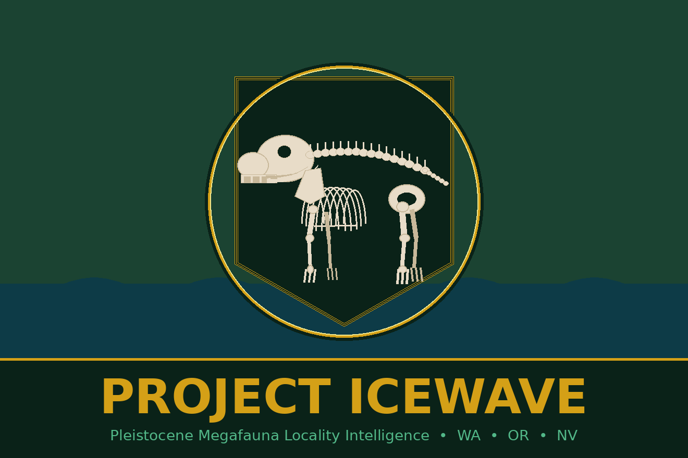

# 🦣 Project IceWave



    

> *The ice came. The mammoths came with it. Then both disappeared — but the bones remain.*

During the Pleistocene epoch (2.6M–11,700 years ago), Columbian mammoths (*Mammuthus columbi*) and woolly mammoths (*Mammuthus primigenius*) roamed the Pacific Northwest and Great Basin. Ancient lakes filled Nevada's valleys. Glaciers carved Washington's channeled scablands. And everywhere they walked, they left bones.

**Project IceWave asks: where haven't we looked yet?**

---

## 🎯 Mission

Use a split-ecoregion machine learning approach on USGS terrain data, SGMC lithology, and merged PBDB + iDigBio occurrence records to predict undiscovered Pleistocene megafauna fossil localities across Washington, Oregon, and Nevada.

---

## 🤖 Model v2 — Split Ecoregion

The Cascade Mountain crest (~-121.5°W) divides the study area into two independently trained Random Forest models:

| Model | Ecoregion | Training Points | CV AUC | Confidence |
|-------|-----------|-----------------|--------|------------|
| **West RF** | Willamette Valley / Puget Sound / Coast Range | 35 | **0.890 ± 0.105** | ★ HIGH |
| **East RF** | Columbia Plateau / Basin & Range / Nevada | 17 | 0.566 ± 0.121 | ○ LOW |
| v1 Baseline | Combined WA/OR/NV | 78 | 0.853 ± 0.063 | Reference |

### Features (v2)
| Feature | Source | v1 Importance |
|---------|--------|---------------|
| Elevation | USGS 3DEP ~30m | 0.346 |
| TRI (Ruggedness) | Derived from DEM | 0.271 |
| Slope | Derived from DEM | 0.197 |
| Aspect | Derived from DEM | 0.187 |
| **Lith Score** *(new)* | USGS SGMC | — |

Composite score = **80% ML probability + 20% lithology favorability**

### Top Targets
| Rank | Ecoregion | Coordinates | Score | Confidence |
|------|-----------|-------------|-------|------------|
| W01 | Tualatin Valley, OR | 45.1753°N, -122.8419°W | 1.000 | ★ HIGH |
| W02 | Willamette Valley, OR | 45.7169°N, -122.6753°W | 0.981 | ★ HIGH |
| W03 | Snohomish area, WA | 47.8558°N, -121.8003°W | 0.975 | ★ HIGH |
| E01 | Kittitas Valley, WA | 46.9114°N, -120.3281°W | 1.000 | ○ LOW |
| E02 | Walla Walla area, WA | 46.0781°N, -118.2308°W | 0.936 | ○ LOW |

---

## 🦣 Target Species

| Species | Common Name | Region |
|---------|-------------|--------|
| *Mammuthus columbi* | Columbian Mammoth | All three states |
| *Mammuthus primigenius* | Woolly Mammoth | WA, OR |
| *Mammut americanum* | American Mastodon | WA, OR |
| *Equus sp.* | Pleistocene Horse | WA, OR, NV |
| *Camelops hesternus* | Yesterday's Camel | WA, OR, NV |
| *Paramylodon harlani* | Harlan's Ground Sloth | OR, NV |
| *Bison sp.* | Pleistocene Bison | WA, OR, NV |
| *Arctodus simus* | Short-faced Bear | WA, OR, NV |
| *Cervus sp.* | Pleistocene Elk | WA, OR |

---

## 📁 Project Structure

```
project_ice_wave/
├── notebooks/
│   ├── 01_pbdb_harvester.ipynb        # PBDB API → Pleistocene occurrences
│   ├── 01b_idigbio_harvester.ipynb    # iDigBio API → 304 additional records
│   ├── 01c_merge_and_enrich.ipynb     # Merge + dedupe + SGMC lith enrichment
│   ├── 02_terrain_analysis.ipynb      # USGS 3DEP DEM → terrain metrics
│   ├── 03_ml_model.ipynb              # RF v1 — combined model (AUC 0.853)
│   ├── 03b_ml_model_v2.ipynb          # RF v2 — lith_score added (AUC 0.879)
│   └── 03c_ml_model_v2_split.ipynb    # RF v2 split ecoregion (West 0.890 / East 0.566)
├── data/
│   ├── pbdb/                          # PBDB occurrence CSVs + terrain-sampled
│   ├── idigbio/                       # iDigBio occurrence CSV + GeoJSON
│   ├── merged/                        # Deduped merged occurrences + lith scores
│   ├── terrain/                       # DEM mosaic, slope, aspect, TRI rasters
│   ├── geology/                       # Quaternary deposits shapefile
│   │   └── SGMC/                      # USGS SGMC (gitignored — too large)
│   ├── paleolakes/                    # NHD waterbodies GeoJSON
│   └── model/                         # Trained models + target CSVs
├── outputs/
│   ├── IceWave_Field_Report.pdf       # v1 field report
│   ├── IceWave_Field_Report_v2.pdf    # v2 split ecoregion field report
│   ├── icewave_targets.kmz            # v1 Google Earth file
│   ├── icewave_targets.gpx            # v1 GPS waypoints
│   ├── icewave_v2_split_targets.kmz   # v2 Google Earth — cyan=west, yellow=east
│   └── icewave_v2_split_targets.gpx   # v2 GPS waypoints — IW-W## / IW-E##
├── assets/
│   └── icewave_flag.png               # Project flag — Cascadia tricolor + mammoth
└── pixi.toml                          # Reproducible environment
```

---

## ⚙️ Setup

```bash
git clone https://github.com/bdgroves/project_ice_wave.git
cd project_ice_wave
pixi install
pixi run lab
```

---

## 🗺️ Study Area

Three-state coverage: **Washington · Oregon · Nevada**

Key target zones:
- **Willamette Valley, OR** — Missoula Flood sediments, Pleistocene lake clay/silt (★ top west zone)
- **Puget Sound Lowlands, WA** — Glacial outwash, river floodplains (★ high priority)
- **Kittitas / Columbia Basin, WA** — Intermontane Quaternary basins (○ east reconnaissance)
- **Channeled Scablands, WA** — Post-glacial terrain
- **Great Basin, NV** — Pleistocene lake beds (Lake Lahontan shorelines)

---

## 📊 Data Sources

| Source | Records | Use |
|--------|---------|-----|
| [Paleobiology Database](https://paleobiodb.org) | 78 occurrences | Training — all models |
| [iDigBio](https://idigbio.org) | 304 raw → 65 deduped | Training — west model |
| [USGS 3DEP](https://www.usgs.gov/3d-elevation-program) | 25 DEM tiles | Terrain features |
| [USGS SGMC](https://www.usgs.gov/programs/national-cooperative-geologic-mapping-program/science/sgmc) | National geology | Lithology scoring |
| [USGS NHD](https://www.usgs.gov/national-hydrography) | Waterbodies | Paleolake proximity |

---

## ⚠️ Disclaimer

This is a research tool. Predicted localities do NOT guarantee fossil presence. **Vertebrate fossil collection on federal land requires a PRPA permit.** Verify land ownership before entering any site. The east model (AUC 0.566) should be treated as reconnaissance-grade only.

BLM Oregon/Washington: 503-808-6002 · BLM Nevada: 775-861-6400

---

## 🔗 Sister Project

Built on the workflow developed for [Project PaleoWave](https://github.com/bdgroves/Project-PaleoWave) — ML-assisted ichthyosaur locality prediction in Nevada (AUC 0.906).

---

*Project IceWave — Because the ice age isn't over if you know where to look.* 🦣🧊
